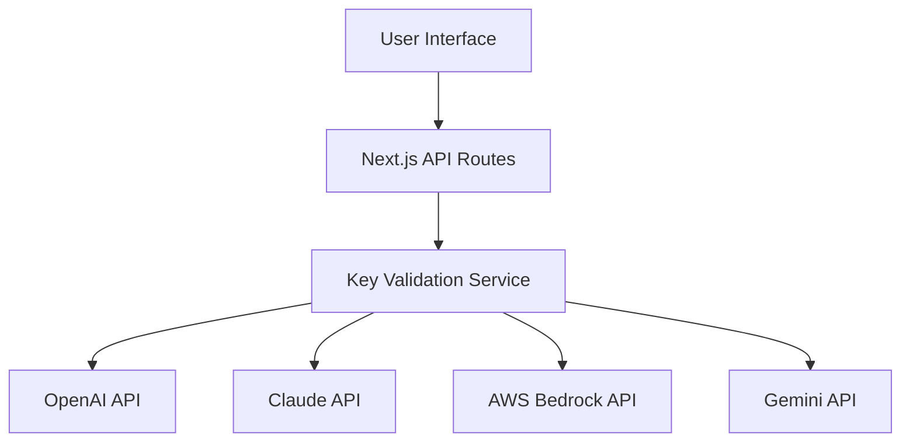

# API Key Checker - Project Plan

## Project Overview
A Vercel-hosted application that allows users to check if their LLM API keys (OpenAI, Claude, AWS Bedrock, Google Gemini) are valid and working.

## Architecture Overview

## Technology Stack
- **Frontend**: Next.js with React
- **Backend**: Next.js API routes (serverless functions)
- **API Interaction**: Python scripts via edge functions or serverless functions
- **Styling**: Tailwind CSS
- **Deployment**: Vercel

## Implementation Plan

### Phase 1: Setup & Structure ✅
- [x] Initialize Next.js project with TypeScript
- [x] Configure serverless Python runtime for Vercel
- [x] Setup project repository structure
- [x] Create basic UI components

### Phase 2: Core Functionality ✅
- [x] Create form components for API key submission
- [x] Implement server-side validation functions for each provider:
  - [x] OpenAI key validation
  - [x] Claude key validation
  - [x] AWS Bedrock key validation
  - [x] Gemini key validation
- [x] Build API routes to handle validation requests
- [x] Add appropriate error handling

### Phase 3: User Experience ✅
- [x] Design clean, intuitive interface
- [x] Add loading states and animations
- [x] Implement proper feedback mechanisms
- [x] Add explicit message about not storing keys
- [x] Ensure responsive design

### Phase 4: Security Measures ✅
- [x] Implement HTTPS-only access (via Vercel)
- [x] Configure CSP headers (in next.config.js)
- [x] Ensure no key logging in server logs
- [x] Verify no client-side storage of keys
- [ ] Add rate limiting to prevent abuse

### Phase 5: Testing & Deployment ✅
- [ ] Test with valid and invalid keys
- [x] Configure Vercel deployment (vercel.json)
- [ ] Deploy to Vercel
- [ ] Final end-to-end testing

## Security Considerations
- Keys will be transmitted but never stored
- All validation happens server-side in ephemeral functions
- Memory cleared after validation
- No logging of sensitive data

## Timeline Estimate
- Phase 1: 1-2 days
- Phase 2: 2-3 days
- Phase 3: 1-2 days
- Phase 4: 1 day
- Phase 5: 1 day

Total: 6-9 days for complete implementation
